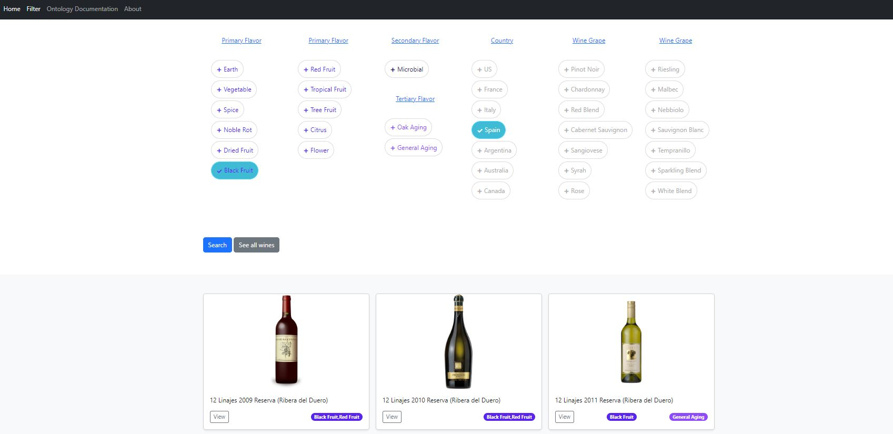

Information Organzation Group Project

Website which lets users find wines based on their taste. The "taste" tags were assigned automatically to 52 000 wines based on their reviews, using a supervised machine learning model. Documentation for the created wine tasting ontology was also embedded in the website.

